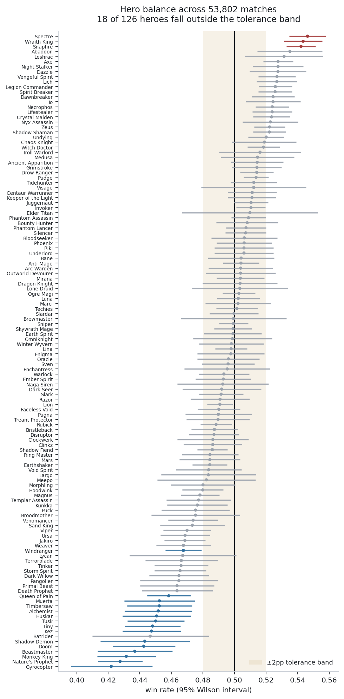
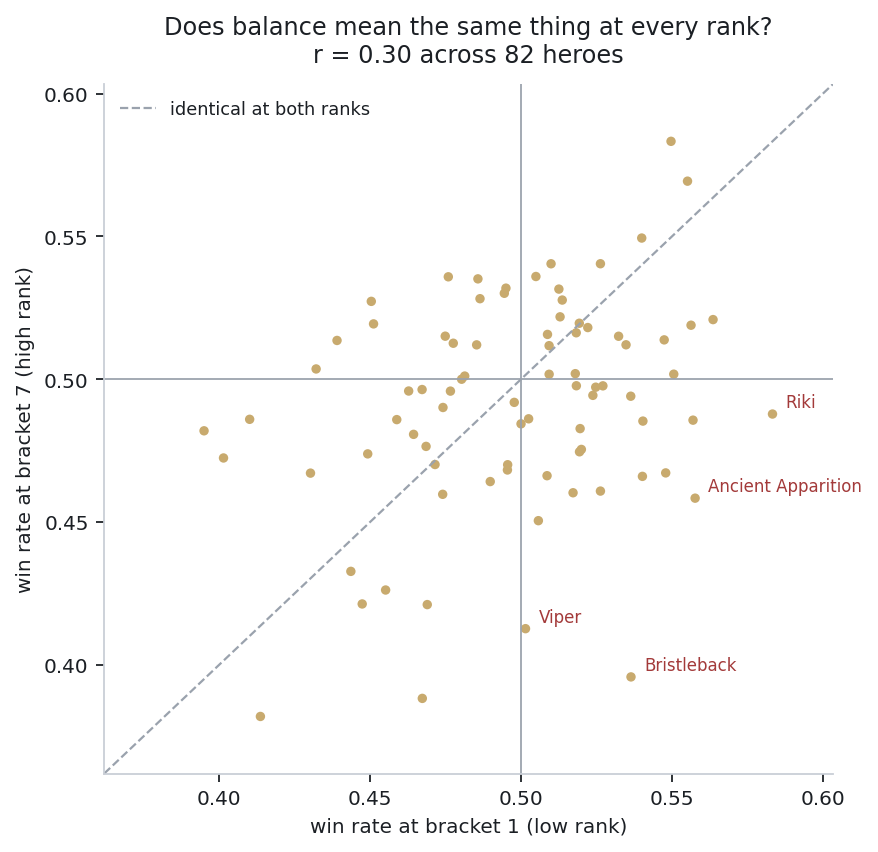
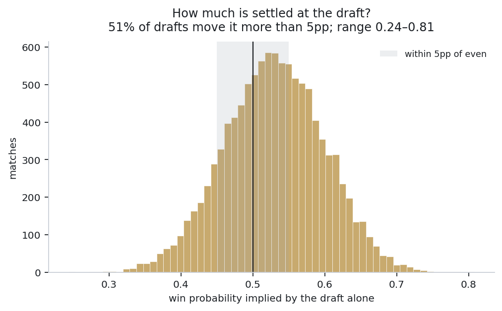
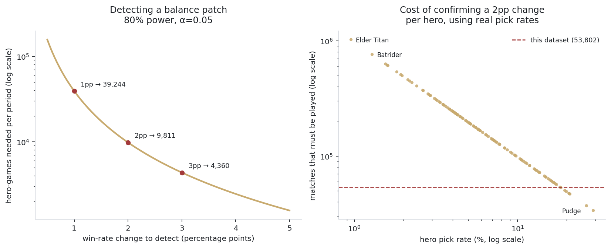

# Is Dota 2 Balanced?

A statistical audit of hero, side and draft balance across 53,802 ranked
matches from the OpenDota API.

[](https://huggingface.co/spaces/Radowana/dota-balance-audit)
[](https://www.python.org)
[](https://duckdb.org)
[](LICENSE)

Valve rebalances Dota 2 every few weeks across 126 heroes. This asks whether it
works, and — more usefully — how anyone would be able to tell.

**Short answer: yes, tightly, with three specific exceptions and one structural
imbalance nobody can patch.** The longer answer is that the interesting problem
here is not measuring balance but deciding what counts as imbalance, because at
this sample size statistical significance stops being a useful filter.

---

## Findings

<!-- FINDINGS:START -->

Based on **53,802** ranked All Draft matches, covering **126** heroes with at least 500 games each.

### 1. The roster is tightly balanced, but not perfectly

Win rates span **42.2% to 54.6%** — a 12.4 point range, standard deviation 2.63pp. For a game with 126 asymmetric heroes, that is a narrow band.

| | Hero | Games | Win rate | 95% CI |
|---|---|---|---|---|
| ▲ | Spectre | 6,989 | 54.6% | [53.5%, 55.8%] |
| ▲ | Wraith King | 6,381 | 54.3% | [53.1%, 55.6%] |
| ▲ | Snapfire | 11,117 | 54.2% | [53.3%, 55.1%] |
| ▼ | Gyrocopter | 1,415 | 42.2% | [39.6%, 44.8%] |
| ▼ | Nature's Prophet | 4,662 | 42.7% | [41.3%, 44.2%] |
| ▼ | Monkey King | 2,719 | 43.1% | [41.3%, 45.0%] |

### 2. At this sample size, statistical significance is the wrong question

Testing every hero against 50%, **63 of 126** come back significant at α=0.05 — against roughly 6 expected by chance. Applying Benjamini–Hochberg FDR correction removes almost nothing: **59** still survive.

That is the finding, not a footnote. With 50,000 matches the tests are so well powered that a hero sitting 0.8 points off even is detectable — and completely irrelevant to a balance decision. **Significance stopped discriminating; effect size has to do the work.**

Applying a practical tolerance of ±2pp and requiring the whole confidence interval to clear it, the 59 "significant" heroes reduce to **18 genuinely actionable ones**:

- **Overperforming (3):** Snapfire, Wraith King, Spectre
- **Underperforming (15):** Gyrocopter, Nature's Prophet, Monkey King, Beastmaster, Doom, Shadow Demon, Kez, Tiny, Tusk, Huskar, Alchemist, Timbersaw, Muerta, Queen of Pain, Windranger

### 3. Radiant's map advantage is real and larger than any hero effect

Radiant wins **52.98%** of matches [52.56%, 53.40%], p = 1.7e-43 — a **3.0 point** structural edge before a single hero is picked. Only three heroes deviate from even by more than the side you were assigned does.

### 4. "Balanced" means different things at different ranks

Correlating hero win rates between the lowest and highest skill brackets gives **r = 0.30** across 82 heroes (p = 6.4e-03). Positive, but weak: a hero's performance at low rank tells you comparatively little about its performance at high rank. A single global win rate averages over two genuinely different games.

### 5. How much does the draft decide?

Using the win-probability model as a measuring instrument across 10,761 held-out drafts:

| Measure | Value |
|---|---|
| Draft-implied win probability, full range | 0.244 – 0.808 |
| 1st–99th percentile | 0.367 – 0.686 |
| Median advantage off even | 5.15pp |
| Drafts moving win probability >5pp | 51.1% |
| Model accuracy from draft alone | 55.9% |
| Information ceiling for this model class | 57.0% |

The honest held-out model sits **1.02 points** below the ceiling obtained by fitting and scoring on all data with no regularisation. The limit is the information in a draft, not the modelling.

### 6. Confirming a balance patch is expensive

Detecting a **2pp** win-rate change at 80% power requires **9,806 hero-games before and after** the patch.

| Change to detect | Hero-games needed per period |
|---|---|
| 0.5pp | 156,973 |
| 1.0pp | 39,240 |
| 2.0pp | 9,806 |
| 3.0pp | 4,356 |
| 5.0pp | 1,565 |

Converted through real pick rates, the median hero needs **170,547 matches** played before a 2pp change becomes visible. The spread is enormous: Pudge (picked in 29.1% of games) needs 33,671, while Elder Titan (1.0%) needs 1,026,425.

<!-- FINDINGS:END -->

<p align="center">
  
</p>
<p align="center">
  
  
</p>
<p align="center">
  
</p>

Every number in the findings above is generated from `artifacts/*.json` by
`analysis/render_report.py`. CI fails the build if the README and the artifacts
disagree, so the report cannot drift away from what the code produced.

---

## Recommendation

If this were a balance review, the actions would be:

**1. Act on three heroes, not fifty-nine.** Snapfire, Wraith King and Spectre
are the only heroes whose entire confidence interval sits above the +2pp
tolerance band. The other fifty-six "statistically significant" heroes are
significant only because the sample is large, and adjusting them would be
responding to noise with extra steps.

**2. Treat the fifteen underperformers as one problem, not fifteen.** They are
disproportionately high-execution heroes — Monkey King, Queen of Pain,
Timbersaw, Nature's Prophet. A hero that requires skill to pilot *should* show a
sub-50% average across all ranks; that is the mechanic working, not a bug. Buffing
them uniformly would break them at the top. This is where a global win rate is
actively misleading and the per-bracket split has to drive the decision.

**3. Do not attempt to balance rarely-picked heroes on win rate.** With a pick
rate near 1%, confirming a 2pp change on Elder Titan needs over a million
matches. Any patch note claiming a measured effect on a niche hero within a
normal patch cycle is describing noise. Use qualitative review for the long tail
and reserve statistical balancing for the top ~30 heroes by pick rate, where the
data arrives fast enough to support it.

**4. Report Radiant advantage separately from hero balance.** A 3-point side
edge is larger than all but three hero effects, and it contaminates every
win-rate comparison that does not control for it.

**What would change my mind:** a second data window either side of a real patch.
This audit is a snapshot, so it can measure the state of balance but not whether
Valve's interventions are what produced it. That is the obvious next study, and
the power analysis above is what sizes it.

---

## Method

### Pipeline

```
data/matches.csv.gz  →  sql/  →  analysis/  →  artifacts/  →  README + figures
   93,112 matches      DuckDB    statistics     JSON/CSV
```

SQL does the aggregation, Python does the statistics. That split is deliberate:
the counting is set-shaped work that belongs in a database, and keeping it there
means the aggregates can be inspected independently of the tests applied to them.

`sql/01_build_tables.sql` unpivots each match's two hero lists into one row per
hero per match — the grain almost every balance question is actually asked at —
and asserts that every match produces exactly ten rows. If that check fails the
pipeline aborts, because a broken unpivot would silently corrupt every number
downstream.

### Statistical choices

**Wilson intervals, not normal approximation.** Win rates sit near 0.5 with
sample sizes from 500 to 15,000. Wilson behaves correctly across that range;
the normal approximation misbehaves in the tails.

**Benjamini–Hochberg, not Bonferroni.** This is a screening exercise — the goal
is a shortlist of heroes worth investigating, so controlling the false discovery
rate is both more appropriate and more powerful than controlling the
family-wise error rate.

**A tolerance band, declared separately from significance.** Set at ±2pp and
stated as a judgement, not derived from the data. A hero must have its *entire*
confidence interval outside the band to be flagged, so the data has to rule out
"only slightly off" before anything is recommended. Conflating statistical and
practical significance is the most common way an analyst misleads their own
stakeholders, and at n = 53,802 it is unavoidable unless handled explicitly.

**The model as an instrument.** The win-probability model
(`src/train.py`, logistic regression on signed hero indicators) is not the
product here. It exists to measure how much outcome the draft explains. Its
modest accuracy is the evidence, not an apology — and the in-sample ceiling
shows it is within about a point of everything a hero-additive model could
extract. Model details, baselines and calibration are in
[docs/MODEL.md](docs/MODEL.md).

### Data

| Filter | Reason |
|---|---|
| `game_mode = 22` (All Draft) | Turbo has roughly half the duration and a different economy; hero win rates there are a different distribution |
| Ten distinct non-zero hero IDs | OpenDota zero-fills hero arrays for matches its parser hasn't reached |
| `duration >= 900s` | Excludes early abandons, where the result reflects a disconnect rather than play |
| `avg_rank_tier` present | Every row must be bucketable by skill |
| `games >= 500` per hero | Below this the win rate is too noisy to act on |

93,112 matches collected, 53,802 surviving the All Draft filter. The exact
dataset is committed, so every number reproduces without touching the API.

---

## Reproduce

```bash
git clone https://github.com/sradowana-ux/dota-balance-audit
cd dota-balance-audit
pip install -r requirements-dev.txt

python analysis/balance.py        # hero tests, BH correction, side balance
python analysis/power.py          # experiment sizing
python analysis/determinism.py    # how much the draft explains
python analysis/figures.py        # all four figures
python analysis/render_report.py  # regenerate the findings block
```

Rebuild the dataset from scratch (~25 minutes; the public API allows 60
calls/minute):

```bash
python src/collect.py --target 100000 --out data/matches.csv
```

Run the dashboard locally:

```bash
pip install -r requirements.txt && python app.py
```

---

## Project structure

```
sql/01_build_tables.sql       unpivot to hero-match grain, integrity assertion
sql/02_hero_winrates.sql      win/pick rates overall, by bracket, by side
analysis/balance.py           binomial tests, Wilson CIs, BH correction
analysis/power.py             minimum detectable effect, matches required
analysis/determinism.py       how much outcome the draft explains
analysis/figures.py           the four figures
analysis/render_report.py     generates the README findings block
src/collect.py                OpenDota collection with quality filters
src/features.py               signed hero encoding
src/train.py                  the measuring instrument + its baselines
tests/                        encoding properties, incl. exact antisymmetry
app.py                        balance dashboard + draft explorer
```

---

## Limitations

1. **A snapshot, not a time series.** All matches come from one contiguous
   window, so this measures the state of balance, not whether patches caused it.

2. **Public matchmaking, not professional play.** All Draft has no ban phase and
   no coordinated counter-picking. None of this transfers to captains mode.

3. **Pick rate and win rate are entangled.** A hero can hold 50% because it is
   balanced, or because only specialists pick it. This audit does not separate
   selection effects from hero strength, and that is a real confound for the
   long tail.

4. **Bracket comparison is underpowered at the extremes.** Bracket 1 has 2,341
   matches, so the low-versus-high correlation rests on 82 heroes clearing the
   per-bracket threshold rather than the full roster.

5. **Region and time of day are uncontrolled.** Matches come from a contiguous
   ID range, so the population mix reflects whoever was queuing during that
   window.

6. **The ±2pp tolerance is a judgement.** It is stated rather than derived, and
   a designer with different priorities would reasonably choose differently. The
   pipeline exposes it as a single constant so it can be changed and the whole
   analysis rerun.

---

## Licence

MIT — see [LICENSE](LICENSE).

Match data from the [OpenDota API](https://docs.opendota.com/), used under its
terms. Not affiliated with Valve Corporation.
