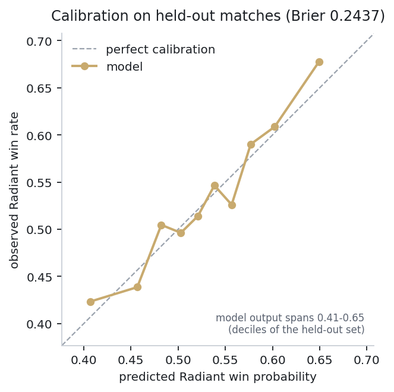
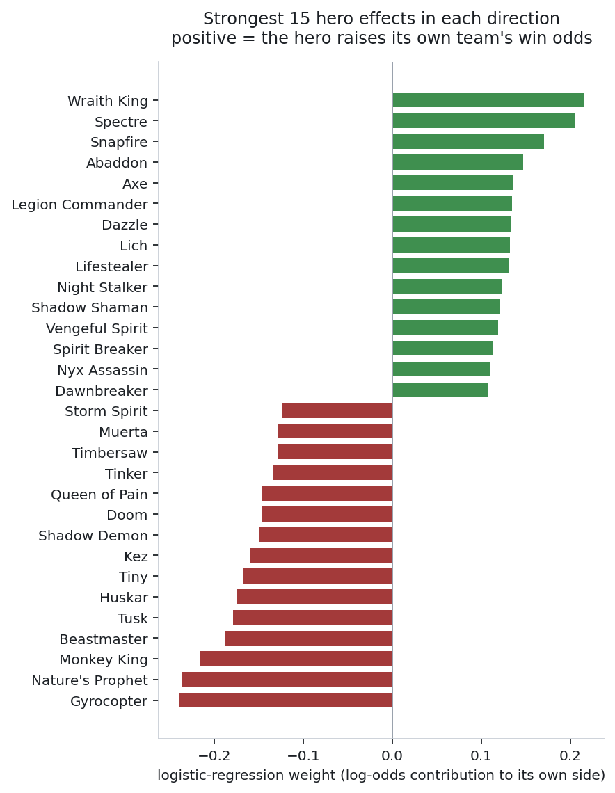

# The draft win-probability model

Supporting document for [the balance audit](../README.md). This model is the
instrument used to answer "how much does the draft decide?" — it is not the
product, and its accuracy is a measurement rather than a target.

---

## Results

<!-- RESULTS:START -->

Trained on **43,041** matches, evaluated on **10,761** strictly later matches (127 heroes, 53,802 total after filtering). Radiant won 53.3% of the held-out matches.

| Model | Accuracy | Log loss | ROC-AUC | Brier |
|---|---|---|---|---|
| Always predict Radiant *(baseline)* | 0.5326 | 0.6910 | — | 0.2490 |
| Solo hero win-rate sum *(baseline)* | 0.5591 | 0.6809 | 0.5816 | 0.2439 |
| **Logistic regression, signed hero features** | 0.5594 | 0.6805 | 0.5825 | 0.2437 |
| Logistic regression + synergy/counter pairs | 0.5649 | **0.6798** | 0.5855 | 0.2434 |
| Gradient boosting (HistGBM) | 0.5575 | 0.6836 | 0.5711 | 0.2452 |

**McNemar's test** on paired held-out predictions, logistic regression vs:

| Compared against | χ² | p | Verdict |
|---|---|---|---|
| Always predict Radiant (baseline) | 23.01 | 1.61e-06 | significant at α=0.05 |
| Solo hero win-rate sum (baseline) | 0.02 | 0.8913 | no significant difference |
| Logistic regression + synergy/counter pairs | 2.33 | 0.1265 | no significant difference |
| Gradient boosting (HistGBM) | 0.19 | 0.6633 | no significant difference |

<!-- RESULTS:END -->

<p align="center">
  
  
</p>

---

## Why the accuracy is what it is

Refitting on all 53,802 matches with no regularisation and scoring **in-sample**
— the best a hero-additive model could ever do on this data — reaches 57.0%.
The honest held-out figure is 55.9%. The model is roughly one point from the
information ceiling of its own class, so the constraint is the draft, not the
fitting.

The learning curve agrees. Going from 20,000 to 43,802 training matches bought
0.2 points of accuracy, and the curve has visibly bent. More data is not the
missing ingredient for the linear model.

For context from the literature: [Song, Zhang & Ma (Stanford CS229, 2015)][song]
report 58% from hero lineups alone and 61% with combination features — the same
neighbourhood, and their combination result mirrors the pairwise finding below.
The widely cited [Conley & Perry (2013)][conley] figure of 69.8% comes from a
much earlier and considerably less balanced version of the game; today's hero
win rates span only 12 points end to end, which caps what any draft-only model
can achieve.

[song]: https://cs229.stanford.edu/proj2015/249_report.pdf
[conley]: http://jmcauley.ucsd.edu/cse258/projects/fa15/018.pdf

---

## Signed hero encoding

A draft is two sets of five heroes. The obvious encoding gives each hero two
columns, one per side, for `2 × n_heroes` features — which lets the model learn
two unrelated weights for the same hero. That is wrong: Dota is close to
side-symmetric, so a hero worth `+w` to Radiant should be worth `−w` to Dire.

One column per hero instead:

```
x[h] = +1  if hero h is on Radiant
       -1  if hero h is on Dire
        0  otherwise
```

This halves the parameter count and makes the antisymmetry exact rather than
approximate: mirroring a draft flips the log-odds about the intercept, so
`P(radiant | draft) = 1 − P(radiant | mirrored draft)` holds by construction.
Radiant's map advantage lands cleanly in the intercept, which is where a
property of the map belongs. `tests/test_features.py` asserts this property
directly.

Because the model is linear in these features, predictions decompose exactly:

```
logit(p) = intercept + Σ w_h over Radiant heroes − Σ w_h over Dire heroes
```

The dashboard shows that decomposition per hero. Nothing is approximated for
interpretability's sake.

---

## What was tried and rejected

**Pairwise synergy and counter features** (~16,000 columns, one per hero pair
per relationship). Scores marginally better on every metric, but McNemar's test
cannot distinguish it from the linear model (p ≈ 0.13). Notably its learning
curve has *not* flattened, so with several hundred thousand matches it would
likely pull ahead — that is the one route to a better number.

**Low-rank interactions, factorization-machine style.** Each hero gets an
embedding and every pair's interaction is derived as a dot product, cutting
16,000 interaction weights to about 2,000. It performs *worse* than the plain
linear model at every rank tried (AUC 0.577 / 0.576 / 0.571 for d = 2, 4, 8
against 0.583), and degrades as the rank grows. The implementation is verified
correct — its antisymmetry error is 1.1 × 10⁻¹⁶ — so this is a genuine negative
result: compressing hero interactions into a low-rank space loses more than it
denoises.

**Gradient boosting** on the same features underperforms the linear model,
which is expected when the true structure is close to additive.

**Per-bracket models.** Fitting separately by skill bracket scores between 54.7%
and 57.7%, no better than the pooled model, so bracket mixing is not what limits
accuracy.

The shipped model is therefore the 127-feature linear one. When two models are
statistically indistinguishable, the tie-break goes to the one whose predictions
decompose exactly.

---

## Evaluation design

* **Chronological split.** Test matches are strictly newer than every training
  match.
* **Two baselines, one trivial and one not.** "Always predict Radiant" only
  proves the model knows which side of the map it is on. Summing each hero's
  solo win rate is what a competent analyst would do without machine learning,
  and it is the bar that matters.
* **Calibration alongside accuracy.** Reliability curve, Brier score and log
  loss, because the dashboard hands users a probability.
* **McNemar's test** on paired predictions — the correct test for two
  classifiers on one test set.
* **Hyperparameters by `TimeSeriesSplit` CV on training data only.** The test
  set is touched once.

---

## Honest caveats

1. **No player skill.** Identical drafts played by very different players get
   identical predictions. `avg_rank_tier` is collected but deliberately unused:
   it says nothing about which *side* wins, and adding it would inflate apparent
   performance without improving what the dashboard does.
2. **Accuracy and log loss disagree.** The solo win-rate baseline matches the
   model on raw accuracy; the model wins on log loss and Brier. For a
   probability model that is the property that matters, but it is worth stating
   plainly rather than quoting only the favourable metric.
3. **A narrow time window.** The chronological split is genuinely
   forward-looking but spans a short period, so it cannot test robustness across
   a patch boundary.
