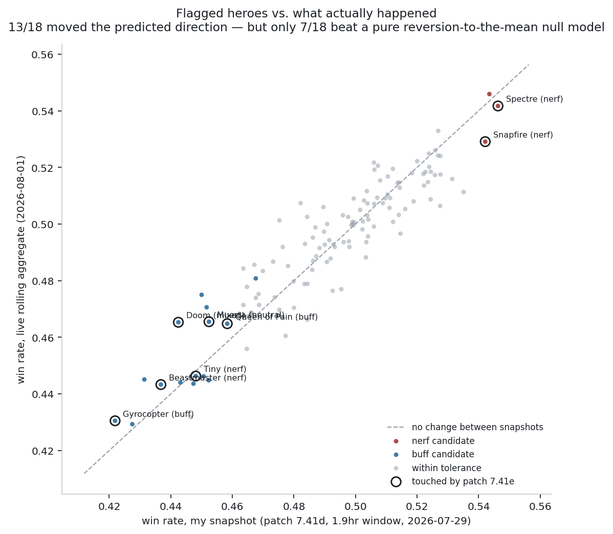

# Did the audit predict the patch, or did the mean just revert?

Supporting document for [the balance audit](../README.md). Generated by
`analysis/patch_followup.py` from `artifacts/hero_balance.csv` (the audit,
collected in a 1.9-hour window inside patch 7.41d on 2026-07-29) and
`data/live_herostats_2026-08-01.csv` (OpenDota's rolling public `/api/heroStats`
aggregate, pulled 2026-08-01, roughly 30 hours after patch 7.41e shipped).

  

## The headline, and why it's not the finding

The audit flagged 18 of 126 heroes as actionable: 3 "nerf candidates" whose
win rate sat above the tolerance band, 15 "buff candidates" below it.
Cross-checking against live data collected after patch 7.41e:

**13 of 18 moved in the direction the audit would have predicted** — nerf
candidates got worse, buff candidates got better. That sounds like validation.
It isn't, or at least not on its own, for one reason: **my snapshot was a
1.9-hour window.** A win rate estimated from a couple thousand games is noisy,
and noisy estimates regress toward the true value on their own, with no patch
required. The heroes the audit flagged are, by construction, the ones that
looked most extreme in that noisy snapshot — which makes them exactly the
heroes most likely to drift back toward 50% between snapshots for reasons that
have nothing to do with Valve.

This isn't a hypothetical concern. Fitting `live_delta = a + b·(my_win_rate -
50%)` across **all 126 audited heroes, not just the flagged ones**, gives
`b = -0.16` with **r = -0.43, p = 6×10⁻⁷**. Heroes further from 50% in my
snapshot reliably moved back toward 50% in the live data, across the entire
roster — flagged or not, touched by the patch or not. Some amount of "the
audit's predictions came true" is just this regression line operating on the
18 heroes that happened to be furthest out.

## The actual test: does the audit beat that reversion on its own?

To separate the two effects, I fit the reversion line on the 108 *unflagged*
heroes only — heroes with no directional prediction attached — and used it to
ask what each flagged hero's live win rate "should" be from noise alone. If a
flagged hero moved further in the predicted direction than that null model
expects, that's the audit adding information beyond what a naive statistician
would already expect from a small sample size.

**7 of 18 flagged heroes beat the null model in the predicted direction — a
coin flip (binomial p = 0.48).** The honest read: this snapshot cannot
distinguish "the audit's balance calls were right" from "small samples regress
to the mean." Thirteen-of-eighteen is a nice number to lead with; it is mostly
explained by noise, not signal.

## What was actually changed on purpose

Patch 7.41e's notes ([dota2protracker.com/patches/7.41e](https://dota2protracker.com/patches/7.41e),
accessed 2026-08-01) touched 8 of the 18 flagged heroes directly:

| Hero | My verdict | Valve's change | Direction | Live Δ (pub, all skill) |
|---|---|---|---|---|
| Snapfire | nerf candidate | 3 talents weakened | nerf | **−1.30pp** ✓ |
| Spectre | nerf candidate | illusion damage cut | nerf | **−0.46pp** ✓ |
| Doom | buff candidate | mixed: range cut, burn damage up | mixed | +2.28pp |
| Gyrocopter | buff candidate | mana/cooldown cuts | buff | **+0.86pp** ✓ |
| Beastmaster | buff candidate | 2 talents weakened | **nerf** | +0.65pp |
| Queen of Pain | buff candidate | mana cost cut, damage stacking | buff | **+0.65pp** ✓ |
| Muerta | buff candidate | invisibility QoL fix only | neutral | +1.31pp |
| Tiny | buff candidate | HP regen cut | **nerf** | −0.18pp |

Two things stand out here that a simple "did it move right" tally hides:

1. **Beastmaster and Tiny were both flagged as underperforming, and Valve
   nerfed them anyway.** Patch 7.41e landed two weeks before The International
   — see [esportnow.gg's coverage](https://esportnow.gg/dota2/news/dota-2-patch-7-41e-summer-scrub)
   — and changed 56 heroes with competitive and pro-meta priorities in mind,
   not this dataset's pub win rates. A balance audit built for pub matchmaking
   and Valve's actual patch cadence are answering different questions; treating
   patch notes as a ground-truth oracle for "what should have been buffed" is
   the wrong frame.
2. **The other 10 flagged heroes** (Wraith King, Windranger, Timbersaw,
   Alchemist, Huskar, Tusk, Kez, Shadow Demon, Monkey King, Nature's Prophet)
   **received no changes in 7.41e at all.** Whatever their live win rate did
   is meta drift and reversion, full stop — there is no patch effect to
   attribute it to. They're the control group, and their movement (mixed:
   5 up, 5 down) looks like noise, which is what it should look like if the
   reversion-to-mean story is right.

## The pro/pub divide is its own finding

Cross-referencing dota2protracker's own win-rate deltas (drawn from a
higher-skill, competitive-adjacent population) against OpenDota's pub-wide
aggregate turns up real disagreements on hero-level direction: Spectre's win
rate rose in protracker's sample after being nerfed, while it fell in the pub
aggregate; Doom, Gyrocopter and Beastmaster all show the opposite sign in the
two sources. This is not a data error — it's the same phenomenon the original
audit already documented in finding #4 (bracket win rates correlate at only
r = 0.30 between low and high skill). A patch that reads as a buff at one
skill level can read as a nerf at another, because different brackets solve
the hero differently. Any "did the patch work" analysis that doesn't specify
which population it means is asking an underspecified question.

## What this changes about the audit's claims

Nothing in the original findings needs correcting — the tolerance-band logic
and the "18 actionable heroes" call stand as a snapshot judgment, which is all
they ever claimed to be. What this follow-up adds is a boundary on what a
single before/after comparison can prove: **13/18 correct direction is not,
by itself, evidence the audit works**, because a null model with no domain
knowledge attached gets to roughly the same place. Distinguishing the two
requires exactly what the original README's "what would change my mind"
section already asked for — a properly sized study with matched sample
windows on both sides of a patch boundary, not a 1.9-hour snapshot compared
against a rolling aggregate of unknown length. This document is a preview of
that study's logic, run on data that wasn't built for it, and it comes back
appropriately inconclusive.
